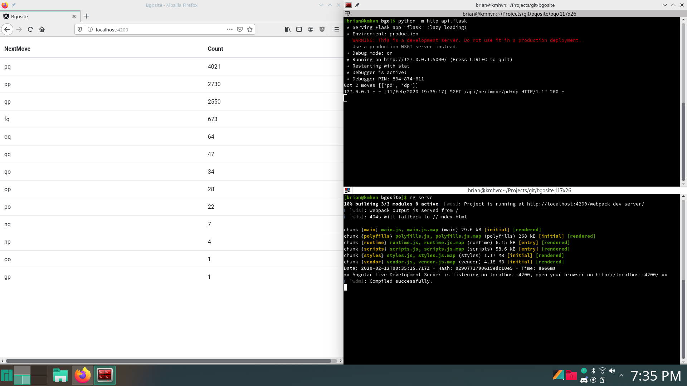

# BGO version 2

A database, command line search engine, and Angular single page application for the game of Go that allows position searches on a collection of game records.

###What is Go?

Go is a two player Asian board game played on a grid of 19 by 19 lines. One player uses black stones, the other uses
white. Players take turns placing a single stone on the board at a time. Stones do not move once placed. The goal of
the game is to surround an many empty intersections (territory) as possible.

Learn Go:
https://www.usgo.org/learn-play

###What's new in this version

After writing the first version of this database, I spent some time learning the MEAN stack. Then I decided to convert BGO to an Angular Single Page Application to practice what I had learned.

The BGO database has been cleaned up with a new layout. A simple Flask RESTful API was added. The API has one endpoint 'nextmove' which takes a list of input moves, and outputs a JSON of the most popular next moves for that position.

For this push the Angular SPA main page looks up next move information for the moves ['pd', 'dp'] and displays the results in a table.

The next version will include a JavaScript Go board that can be clicked on to input moves, and display letters on the board for next moves.

The report generator was removed and will be rewritten.

##Features

* BGO package for database access, go board with rules of go, game record parser, coordinate conversion, diagram generator.
* BSHELL command line interface for selecting database, importing games, rebuilding hashes, and performing simple searches on a text based board.
* Angular Single Access Page with a JavaScript Go board that allows position searches and game review.

##Code Use

* Prompt-Toolkit command line interface https://github.com/mpirnat/dndme
* Game of Go implementation https://github.com/brilee/go_implementation/blob/master/go_naive.py

##How to run

To start the shell or flask server:
    
    cd bgo
    python -m bshell.bshell
    python -m http_api.flask

To start the Angular SPA:
    
    ng serve
  
##Angular SPA Screenshot

  
  
##Command Line Interface Example

    [brian@kmhvn bgo]$ python -m bshell.bshell
    Start /home/brian/Projects/git/bgosite/bgo/bshell  Work /home/brian/Projects/git/bgosite/bgo
    Using database [/home/brian/Projects/git/bgosite/bgo/database.sqlite] with 56676 games.
    Registered Board
    Registered Cd
    Registered Cwd
    Registered Dbfile
    Registered Help
    Registered Import
    Registered ListCommands
    Registered Ls
    Registered Mark
    Registered Play
    Registered Search
    Registered Undo
    
    > dbfile test.sqlite
    
    *** Database /home/brian/Projects/git/bgosite/bgo/test.sqlite does not exist.
       Create new database? (YES) > YES
       Opened /home/brian/Projects/git/bgosite/bgo/test.sqlite with 0 games.
    
    > ls
    
    Directory: /home/brian/Projects/git/bgosite/bgo
       Directories: [game_of_go], [database], [bshell], [.idea], [http_api], [utils]
             Files: TestSGF.tgz, 2000.tgz, test.sqlite, database.sqlite
    
    > import 2000.tgz
    
    *** Using database file /home/brian/Projects/git/bgosite/bgo/test.sqlite
    *** About to import /home/brian/Projects/git/bgosite/bgo/2000.tgz
        Are you sure? (YES) > YES
    
    Importing games...
       ...Processed 100 / 1641 (6%)
       ...Processed 200 / 1641 (12%)       
       ...Processed 300 / 1641 (18%)
       ... snip
       ...Processed 1400 / 1641 (85%)
       ...Processed 1500 / 1641 (91%)
       ...Processed 1600 / 1641 (98%)
    
    Rebuilding final positions...
       ...100 / 1614
       ...200 / 1614
       ...300 / 1614
       ... snip
       ...1400 / 1614
       ...1500 / 1614
       ...1600 / 1614
    
    Rebuilding board hashes...
       ...100 / 1614
       ...200 / 1614
       ...300 / 1614
       ... snip
       ...1400 / 1614
       ...1500 / 1614
       ...1600 / 1614
       Done processing games, inserting into database...
    
    ...Done
    
    Elapsed Time: 0:00:31.093584
    Found 1614 game records, added 1614 games.
    0 duplicates, 27 parse errors
    >
    
    board> board
    
       A B C D E F G H I J K L M N O P Q R S
     a . . . . . . . . . . . . . . . . . . . a
     b . . . . . . . . . . . . . . . . . . . b
     c . . . . . . . . . . . . . . . . . . . c
     d . . . + . . . . . + . . . . . + . . . d
     e . . . . . . . . . . . . . . . . . . . e
     f . . . . . . . . . . . . . . . . . . . f
     g . . . . . . . . . . . . . . . . . . . g
     h . . . . . . . . . . . . . . . . . . . h
     i . . . . . . . . . . . . . . . . . . . i
     j . . . + . . . . . + . . . . . + . . . j
     k . . . . . . . . . . . . . . . . . . . k
     l . . . . . . . . . . . . . . . . . . . l
     m . . . . . . . . . . . . . . . . . . . m
     n . . . . . . . . . . . . . . . . . . . n
     o . . . . . . . . . . . . . . . . . . . o
     p . . . + . . . . . + . . . . . + . . . p
     q . . . . . . . . . . . . . . . . . . . q
     r . . . . . . . . . . . . . . . . . . . r
     s . . . . . . . . . . . . . . . . . . . s
       A B C D E F G H I J K L M N O P Q R S
    
    > play pd
    
       A B C D E F G H I J K L M N O P Q R S
     a . . . . . . . . . . . . . . . . . . . a
     b . . . . . . . . . . . . . . . . . . . b
     c . . . . . . . . . . . . . . . . . . . c
     d . . . + . . . . . + . . . . . X . . . d
     e . . . . . . . . . . . . . . . . . . . e
     f . . . . . . . . . . . . . . . . . . . f
     g . . . . . . . . . . . . . . . . . . . g
     h . . . . . . . . . . . . . . . . . . . h
     i . . . . . . . . . . . . . . . . . . . i
     j . . . + . . . . . + . . . . . + . . . j
     k . . . . . . . . . . . . . . . . . . . k
     l . . . . . . . . . . . . . . . . . . . l
     m . . . . . . . . . . . . . . . . . . . m
     n . . . . . . . . . . . . . . . . . . . n
     o . . . . . . . . . . . . . . . . . . . o
     p . . . + . . . . . + . . . . . + . . . p
     q . . . . . . . . . . . . . . . . . . . q
     r . . . . . . . . . . . . . . . . . . . r
     s . . . . . . . . . . . . . . . . . . . s
       A B C D E F G H I J K L M N O P Q R S
    
    > search
    
       A B C D E F G H I J K L M N O P Q R S
     a . . . . . . . . . . . . . . . . . . . a
     b . . . . . . . . . . . . . . . . . . . b
     c . . . c . . . . . . . . . . . . . . . c
     d . . . a . . . . . + . . . . . X . . . d
     e . . . f . . . . . . . . . . . . . . . e
     f . . . . . . . . . . . . . . . . . . . f
     g . . . . . . . . . . . . . . . . . . . g
     h . . . . . . . . . . . . . . . . . . . h
     i . . . . . . . . . . . . . . . . . . . i
     j . . . + . . . . . + . . . . . + . . . j
     k . . . . . . . . . . . . . . . . . . . k
     l . . . . . . . . . . . . . . . . . . . l
     m . . . . . . . . . . . . . . . . . . . m
     n . . . . . . . . . . . . . . . . . . . n
     o . . . . . . . . . . . . . . . . . . . o
     p . . e b . . . . . + . . . . . + . . . p
     q . . d . . . . . . . . . . . . . . . . q
     r . . . . . . . . . . . . . . . . . . . r
     s . . . . . . . . . . . . . . . . . . . s
       A B C D E F G H I J K L M N O P Q R S
    a: 649, b: 360, c: 144, d: 13, e: 10, f: 2
    >
    
    playb> play b
    
    
    
       A B C D E F G H I J K L M N O P Q R S
     a . . . . . . . . . . . . . . . . . . . a
     b . . . . . . . . . . . . . . . . . . . b
     c . . . . . . . . . . . . . . . . . . . c
     d . . . + . . . . . + . . . . . X . . . d
     e . . . . . . . . . . . . . . . . . . . e
     f . . . . . . . . . . . . . . . . . . . f
     g . . . . . . . . . . . . . . . . . . . g
     h . . . . . . . . . . . . . . . . . . . h
     i . . . . . . . . . . . . . . . . . . . i
     j . . . + . . . . . + . . . . . + . . . j
     k . . . . . . . . . . . . . . . . . . . k
     l . . . . . . . . . . . . . . . . . . . l
     m . . . . . . . . . . . . . . . . . . . m
     n . . . . . . . . . . . . . . . . . . . n
     o . . . . . . . . . . . . . . . . . . . o
     p . . . O . . . . . + . . . . . + . . . p
     q . . . . . . . . . . . . . . . . . . . q
     r . . . . . . . . . . . . . . . . . . . r
     s . . . . . . . . . . . . . . . . . . . s
       A B C D E F G H I J K L M N O P Q R S
    
    > search
    
       A B C D E F G H I J K L M N O P Q R S
     a . . . . . . . . . . . . . . . . . . . a
     b . . . . . . . . . . . . . . . . . . . b
     c . . . . . . . . . . . . . . . . . . . c
     d . . . + . . . . . + . . . . . X . . . d
     e . . . . . . . . . . . . . . . . . . . e
     f . . . . . . . . . . . . . . . . . . . f
     g . . . . . . . . . . . . . . . . . . . g
     h . . . . . . . . . . . . . . . . . . . h
     i . . . . . . . . . . . . . . . . . . . i
     j . . . + . . . . . + . . . . . + . . . j
     k . . . . . . . . . . . . . . . . . . . k
     l . . . . . . . . . . . . . . . . . . . l
     m . . . . . . . . . . . . . . . . . . . m
     n . . . . . . . . . . . . . . . . . . . n
     o . . . . . . . . . . . . . . . . . . . o
     p . . . O . . . . . + . . . . . c a . . p
     q . . . . . d . . . . . . . f e b . . . q
     r . . . . . . . . . . . . . . . . . . . r
     s . . . . . . . . . . . . . . . . . . . s
       A B C D E F G H I J K L M N O P Q R S
    a: 140, b: 99, c: 64, d: 43, e: 8, f: 2
    
    > play a
    
       A B C D E F G H I J K L M N O P Q R S
     a . . . . . . . . . . . . . . . . . . . a
     b . . . . . . . . . . . . . . . . . . . b
     c . . . . . . . . . . . . . . . . . . . c
     d . . . + . . . . . + . . . . . X . . . d
     e . . . . . . . . . . . . . . . . . . . e
     f . . . . . . . . . . . . . . . . . . . f
     g . . . . . . . . . . . . . . . . . . . g
     h . . . . . . . . . . . . . . . . . . . h
     i . . . . . . . . . . . . . . . . . . . i
     j . . . + . . . . . + . . . . . + . . . j
     k . . . . . . . . . . . . . . . . . . . k
     l . . . . . . . . . . . . . . . . . . . l
     m . . . . . . . . . . . . . . . . . . . m
     n . . . . . . . . . . . . . . . . . . . n
     o . . . . . . . . . . . . . . . . . . . o
     p . . . O . . . . . + . . . . . + X . . p
     q . . . . . . . . . . . . . . . . . . . q
     r . . . . . . . . . . . . . . . . . . . r
     s . . . . . . . . . . . . . . . . . . . s
       A B C D E F G H I J K L M N O P Q R S
    
    > search
    
       A B C D E F G H I J K L M N O P Q R S
     a . . . . . . . . . . . . . . . . . . . a
     b . . . . . . . . . . . . . . . . . . . b
     c . . f b . . . . . . . . . . . . . . . c
     d . . . a d . . . . + . . . . . X . . . d
     e . . . e . . . . . . . . . . . . . . . e
     f . . . . . . . . . . . . . . . . . . . f
     g . . . . . . . . . . . . . . . . . . . g
     h . . . . . . . . . . . . . . . . . . . h
     i . . . . . . . . . . . . . . . . . . . i
     j . . . + . . . . . + . . . . . + . . . j
     k . . . . . . . . . . . . . . . . . . . k
     l . . . . . . . . . . . . . . . . . . . l
     m . . . . . . . . . . . . . . . . . . . m
     n . . . . . . . . . . . . . . . . . . . n
     o . . . . . . . . . . . . . . . . . . . o
     p . . . O . . . . . + . . . . . + X . . p
     q . . . . . . . . . . . . . . c . . . . q
     r . . . . . . . . . . . . . . . . . . . r
     s . . . . . . . . . . . . . . . . . . . s
       A B C D E F G H I J K L M N O P Q R S
    a: 82, b: 59, c: 19, d: 2, e: 1, f: 1
    
    exit> exit

